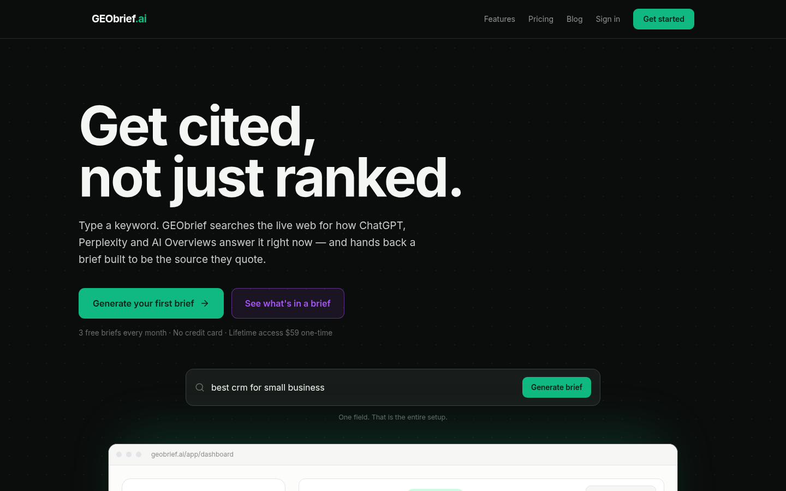
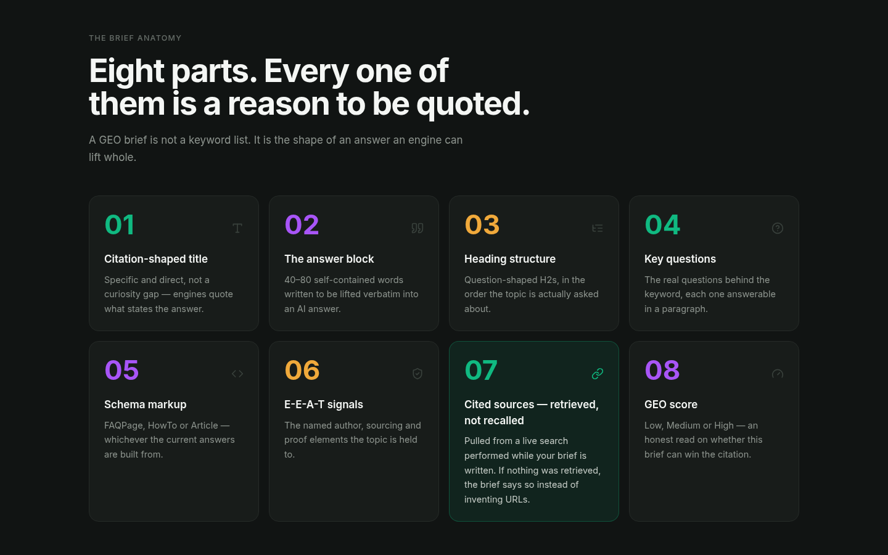
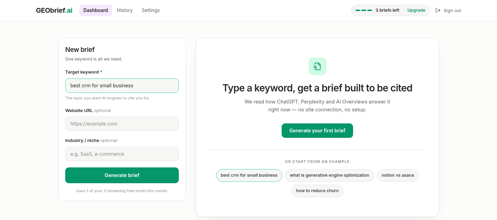
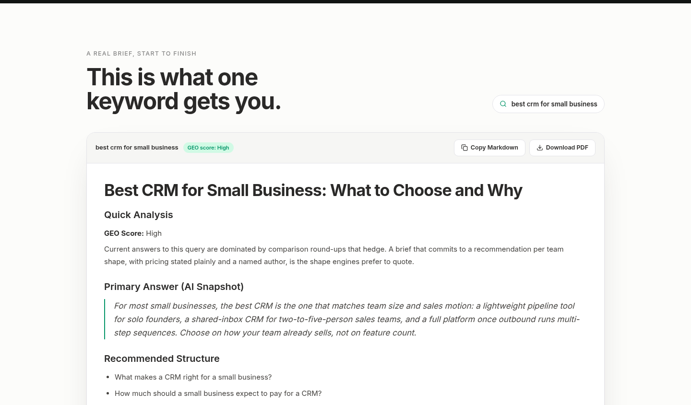
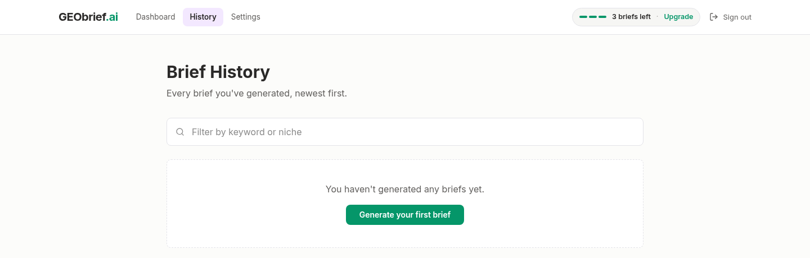
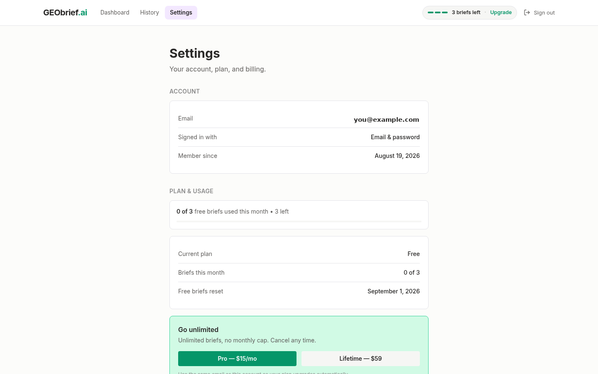

# GEObrief.ai

**Stop writing for Google. Start writing for AI.**

Type a keyword. GEObrief searches the live web for how ChatGPT, Perplexity and Google AI Overviews answer it right now, then hands back a content brief built to be the source they quote, not just another page in a ranked list.

<p align="center">
  
</p>

## What it does

A GEO brief isn't a keyword list. It's the shape of an answer an engine can lift whole: a citation-ready title, a self-contained answer block, question-shaped headings, schema recommendations, E-E-A-T signals, and a GEO score. The one part that matters most, **cited sources**, is built from what a live search actually retrieves, never from a model's recollection. If nothing was retrieved, the brief says so instead of inventing a URL.

<p align="center">
  
</p>

## See it in action

<table>
<tr>
<td width="50%">

<p align="center"><sub>One keyword. No site connection, no Search Console, no setup.</sub></p>
</td>
<td width="50%">

<p align="center"><sub>Real output. Copy as Markdown or export as PDF.</sub></p>
</td>
</tr>
<tr>
<td width="50%">

<p align="center"><sub>Every brief you've generated, filterable and reopenable.</sub></p>
</td>
<td width="50%">

<p align="center"><sub>Plan, usage, and billing in one place.</sub></p>
</td>
</tr>
</table>

## Also ships with a blog

Five full GEO/SEO guides, each with Article + FAQPage structured data kept in sync with the visible copy, not a separate schema block that can drift.

<p align="center">
  
</p>

---

## Stack

| Layer | Technology |
|---|---|
| Framework | Next.js 14 (App Router) |
| Styling | Tailwind CSS |
| Database | Supabase (PostgreSQL + RLS) |
| Auth | Supabase Auth: email/password + Google OAuth |
| AI | Groq. `compound-mini` for retrieval, `openai/gpt-oss-20b` for synthesis (see [Notes](#notes)) |
| Payments | Gumroad (Ping webhook) |
| Hosting | Vercel |

## Quick start

```bash
npm install
cp .env.example .env.local   # then fill it in; see .env.example for where each value comes from
npm run dev                  # http://localhost:3000
```

Before the app will work end to end you also need to run the database migrations. See [Database setup](#database-setup).

## Routes

| Route | Purpose |
|---|---|
| `/` | Landing page: hero, brief anatomy, pricing, FAQ, structured data |
| `/blog`, `/blog/[slug]` | GEO guides (5 posts), Article + FAQPage schema |
| `/privacy`, `/terms` | Legal pages |
| `/auth/signup`, `/auth/login` | Email/password + Google OAuth |
| `/auth/callback` | OAuth / email-confirmation landing point |
| `/app/dashboard` | Generate a brief, copy it, export PDF |
| `/app/history` | Past briefs, filter by keyword, reopen |
| `/app/settings` | Account, plan, usage, billing, sign out |
| `/api/generate-brief` | `POST`: generates a brief (auth + usage gate) |
| `/api/webhooks/gumroad` | `POST`: applies a purchase to a user's plan |
| `/sitemap.xml`, `/robots.txt` | Generated from `content/posts` |

## Database setup

Run the migrations in order, in the Supabase SQL editor:

1. `migrations/001_initial_schema.sql`: `users` and `briefs` tables, indexes, RLS policies
2. `migrations/002_user_provisioning.sql`: trigger that creates a `public.users` row for each new `auth.users` row, plus backfill
3. `migrations/003_gumroad_billing.sql`: Gumroad purchase columns

Migration 002 matters. Signup does **not** create the profile row from the browser (RLS correctly forbids it). The database trigger owns that. Without it, every signed-up account fails its usage lookup.

## How the usage gate works

The free plan allows 3 briefs per calendar month, enforced entirely server-side:

1. The dashboard sends the Supabase access token as `Authorization: Bearer <token>`.
2. `/api/generate-brief` verifies that token and derives the user id from it. The client never supplies its own id.
3. `checkUsageLimit` reads `plan` and `usage_count` with the service-role key, resetting the counter if the month rolled over.
4. Only after the model returns is the brief saved and `usage_count` incremented.

Client-side checks exist only to shape the UI. Removing them changes nothing about what the server allows.

## Gumroad setup

1. Create two products: a `$15/month` subscription and a `$59` one-time purchase.
2. Put their checkout URLs in `NEXT_PUBLIC_GUMROAD_PRO_URL` and `NEXT_PUBLIC_GUMROAD_LIFETIME_URL`.
3. Generate a secret: `openssl rand -hex 32` → `GUMROAD_SECRET_KEY`.
4. In Gumroad, **Settings → Advanced → Ping**, register:
   `https://yourdomain.com/api/webhooks/gumroad?secret=<GUMROAD_SECRET_KEY>`
5. Optionally set `GUMROAD_LIFETIME_PERMALINK` so lifetime purchases map to the lifetime plan rather than being inferred from whether the sale recurs.

Buyers are matched to accounts **by email**, so the purchase email must match the account email. The settings page tells users this; unmatched purchases are logged with a warning and need applying by hand.

**On webhook authentication:** Gumroad Ping does not sign its requests, so there is no signature to verify. The shared secret in the ping URL is the credential. Keep that URL private, and rotate the secret if it leaks.

## Deployment

See [DEPLOYMENT.md](DEPLOYMENT.md) for the full Vercel walkthrough, including OAuth redirect configuration and the post-deploy checklist.

## Project layout

```
app/
  page.tsx              Landing page
  layout.tsx            Root layout + AuthProvider
  blog/                 Blog index + post template
  app/                  Authenticated app (dashboard, history, settings)
  auth/                 Login, signup, OAuth callback
  api/                  generate-brief, webhooks/gumroad
  sitemap.ts, robots.ts
components/             Shared UI (nav, footer, auth guard, brief renderer)
content/
  types.ts              Post type
  posts/                One file per blog post + registry
docs/
  screenshots/          Images used in this README
lib/
  supabase.ts           Browser + service-role clients
  ai.ts                 Groq retrieval + synthesis calls, markdown formatting
  usage.ts              Usage gate
  briefs.ts             Brief persistence
  auth-server.ts        Bearer-token verification for API routes
  auth-context.tsx      Client auth + profile state
  pdf.ts                Markdown → PDF (jsPDF, dynamically imported)
  config.ts             Site + plan constants
migrations/             SQL, run in order
```

## Notes

- **Brief generation is two Groq calls, not one.** `lib/ai.ts` first calls `groq/compound-mini` for search only, then hands the real results to `openai/gpt-oss-20b` (no search tool) to write the brief. A single request asking one model to both search and write a full structured brief reliably exceeds Groq's free-tier per-request token ceiling (about 8,000 tokens/min for the underlying reasoning model, confirmed directly against the API). Splitting the calls also means `citedSources` is assembled by this code from real search results and never re-typed by the writing model, so there's no step where a URL could be misremembered.
- **Known limitation on Groq's free tier:** the retrieval call itself is unreliable independent of the fix above. Confirmed with repeated clean attempts, full token budget available, same failure each time. In practice this means `citedSources` will be empty on most briefs until retrieval moves to a dedicated search API (e.g. Tavily, Brave Search) or the Groq account moves to a paid tier. The app degrades honestly when this happens: the markdown states plainly that no live sources were found rather than presenting invented ones.
- **Blog authorship.** Posts are attributed to "The GEObrief.ai Team." E-E-A-T rewards a named author with verifiable credentials. Swap in a real byline and a `sameAs` profile link in `content/types.ts` before launch.
- **Blog statistics.** The posts deliberately contain no third-party statistics, since unverifiable numbers are a liability on exactly the kind of content that argues for sourcing claims. Where you add data, cite it.
- **Groq is not Grok.** Groq (groq.com) is the inference provider used here. Grok (xAI) is a different product; its web search is a server-side tool on the Responses API, noted in `lib/ai.ts` if you ever switch.

## Scripts

```bash
npm run dev     # dev server
npm run build   # production build
npm start       # serve the production build
npm run lint    # eslint
```
